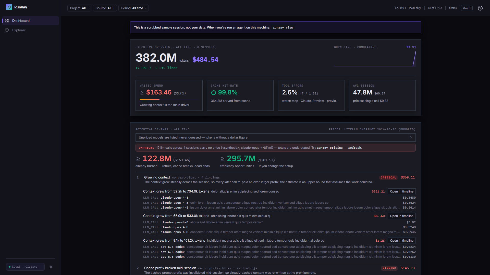
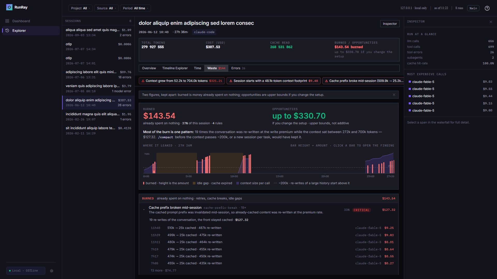
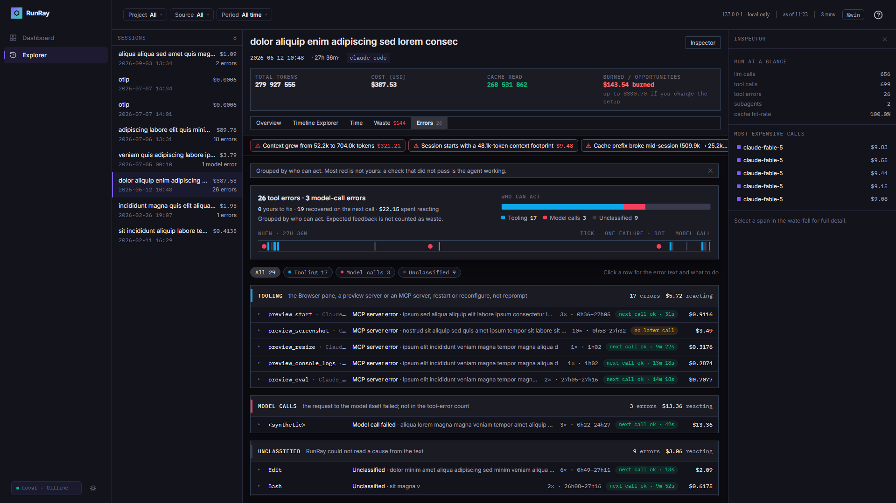
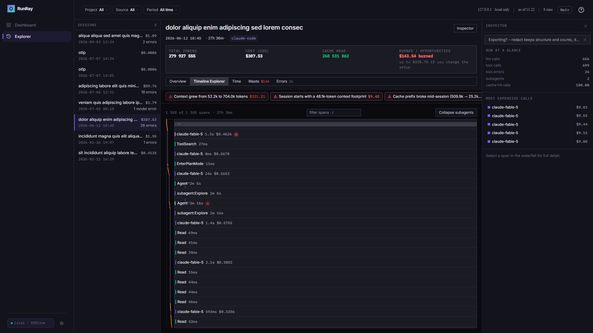

# RunRay

RunRay reads the session logs that Claude Code and OpenCode already keep on your disk and shows you what each session cost, what part of that money bought nothing, and what to change next time. It runs on your machine and talks to nothing.

```bash
npx runray demo   # a scrubbed sample session, no agent data needed
npx runray view   # your own sessions
```



**Status: alpha.** `runray@0.1.0-alpha.3` is on npm and everything on this page works. It is an alpha because the log formats it reads are undocumented and change with every agent release, so some session somewhere will parse oddly. When one does, [open an issue](https://github.com/runray/runray/issues) with your `runray --version` and the agent that wrote the log. That is what the alpha is for.

## Why

Usage trackers tell you how many tokens you spent this week. That number is easy to get and hard to act on. RunRay works one session at a time and answers a different question: where did the money go inside this run, and which part of it was avoidable? "Bash failed three times in a row and the retries cost $0.09" is something you can fix. "138k tokens" is not.

## What you get

- **A dashboard across sessions.** Spend by day, by project, by model and by tool, with a potential-savings panel that keeps two figures apart: money already burned (retries, cache re-writes, dead ends) and savings a different setup would bring.
- **Overview of a session.** Total cost, the tool spend leaderboard, cost by model over time, and a map of what each subagent subtree cost.
- **Timeline Explorer.** The full execution tree as a waterfall: delegation nesting, parallel calls on their own lanes, error marks, and a cumulative-cost gutter you can click to jump to any moment.
- **Time.** Where the wall clock went: model wait, tool execution, coordination, idle gaps.
- **Waste.** What the session burned and what it could have saved, with every burn placed on the session's clock over the context size it happened in.
- **Errors.** Failed calls grouped by who can act on them, with the error text and what to do in your tool.
- **A single-file report.** `runray export -o report.html` writes one HTML file that opens from disk, for a pull request or a Slack thread. `--anonymize` redacts prompt text and pseudonymizes paths first, so the file is safe to hand over.

### Waste



Twelve rules look at each session: retry loops, cache-prefix breaks, cache expiry after an idle gap, duplicate file reads, growing context, heavy fixed context, wrong model tier, expensive subagents, dead-end runs, scattered tool failures, oversized tool outputs, low cache hit-rate. Every finding points at its evidence spans, carries an amount, and ends with one suggestion written for you, not for the model.

Two things matter about the amounts. First, a finding is either *burned* (the money is gone) or an *opportunity* (an upper bound on what a different setup would have saved), and the two are never added into one number. Second, severity is not a property of the rule. The engine grades each finding by its share of that run's cost, so a $0.60 retry loop is a warning in a $0.65 session and a footnote in a $600 one. The Waste tab groups findings by rule and grades the groups the same way, so eighteen small cache breaks read as the 12% they add up to.

The largest opportunity, growing context, deserves a caveat: its estimate assumes the whole session could have run at its opening context size. The tab says so, and shows what keeping the context under 100k, 200k or 400k tokens would have saved instead. Rule formulas, examples and the threshold keys are in [docs/08-FINDINGS.md](https://github.com/runray/runray/blob/main/docs/08-FINDINGS.md).

### Errors



A failed tool call is not one thing. On real sessions about a third of them are the agent's own check-and-fix loop, a third are slips the model corrected on the next call, and fewer than one in ten are something you can act on. The Errors tab reads a class from each failure's text and groups them by owner: yours to fix (a shell the agent misread, a missing binary), tooling (a stuck browser pane, an MCP server), the agent's slips, failed model calls, and the expected feedback of a test that did not pass yet. Each group shows the error text, whether the tool came back, what the reaction cost, and the levers you have in your own tool. The error count in the session list turns red only when a failure is yours or the session never got past one.

### Timeline Explorer



## Where the data comes from

RunRay does not instrument anything and runs no collector. It reads what the agents write:

| Source | What it reads | Notes |
|---|---|---|
| Claude Code | `~/.claude/projects/**/*.jsonl` | Subagent sidechains included. Records a desktop bridge session re-appends are deduplicated. |
| OpenCode | file storage, `opencode.db` (opened read-only), `opencode export` JSON | OpenCode stores `cost: 0`, so the cost engine prices every call from token counts. |
| OTLP/JSON | exported OpenTelemetry traces | For custom agents and Claude Code's native traces. Import only, best effort. |

Prices come from a bundled LiteLLM snapshot. `runray pricing --refresh` fetches a newer one and is the only command that touches the network. A model the snapshot does not know is listed as unpriced, never guessed, and the totals say they are understated. Costs are computed from the transcript, which makes them a lower bound: utility calls, unlogged retries and web-search fees never reach the log.

## Privacy

Everything stays on your machine. The local server binds to 127.0.0.1 only. There is no telemetry, no update check, no account. `--redact` strips prompt and output text in the parser and keeps structure and counts, `--scrub-paths` pseudonymizes project paths, branch names and transcript paths, and `--anonymize` is the two together. `--metadata-only` goes further and prunes leaf spans, keeping containers, totals and findings. All of it happens in core before serialization, never as a UI-side filter, and `runray export` asks for confirmation before it writes an unredacted file.

## Commands

| Command | What it does |
|---|---|
| `runray view [path]` | Find sessions and open the dashboard. `--source claude\|opencode\|otlp`, `--since 7d`, `--watch` to follow a live session, `--redact`, `--port`. |
| `runray list [path] --json` | The same discovery as a machine-readable list. |
| `runray export [path\|runId] -o report.html` | One self-contained HTML file. `--anonymize`, `--metadata-only`, `--redact`, `--scrub-paths`, `--yes` to skip the unredacted confirmation. `--json out.json` also writes the normalized trace. |
| `runray demo` | The dashboard on a bundled, scrubbed sample. |
| `runray diff <runA> <runB>` | Two runs side by side: cost, tokens, errors, alignment. `--json` prints the diff for scripts. |
| `runray pricing [--refresh]` | Show the pricing snapshot, or fetch a current one. |

Thresholds for the rules live in `runray.config.json`, read from the current directory and then from `~/.config/runray/`. Set only the keys you want to change:

```json
{
  "insights": {
    "thresholds": {
      "retryLoop": { "minFailures": 3 },
      "severity": { "warningShare": 0.02, "criticalShare": 0.1 }
    }
  }
}
```

## Compared with usage trackers

ccusage and similar tools answer "how much did I use?" across days and projects. RunRay answers "what happened inside this run, and what should I change?" with evidence you can click through to. Use both.

## What is next

`runray ci`: a budget and cost-regression gate with a GitHub Action, so a pull request can fail on a spend regression the way it fails on a broken test. Agents that keep no session logs on disk arrive through the OTLP path.

Deliberately absent, and staying that way: databases, collectors, SDKs, cloud accounts, alerting.

## Development

```bash
pnpm install
pnpm lint && pnpm typecheck && pnpm test
pnpm build
node packages/cli/dist/bin.js demo
```

```
packages/schema   the versioned TraceFile contract (zod types, JSON Schema)
packages/core     adapters, normalizer, cost engine, findings, triage
packages/cli      commands and the local server; embeds the built UI
packages/ui       the dashboard (Vite, React, Tailwind)
fixtures/         scrubbed sample logs per source and their normalized goldens
openspec/         specs and the change history behind every feature
```

Work follows the specs in `openspec/`: a change starts with a spec delta, fixtures are never edited by hand, and the golden outputs must stay byte-identical unless a commit regenerates them on purpose.

## License

MIT. See [LICENSE](LICENSE).
